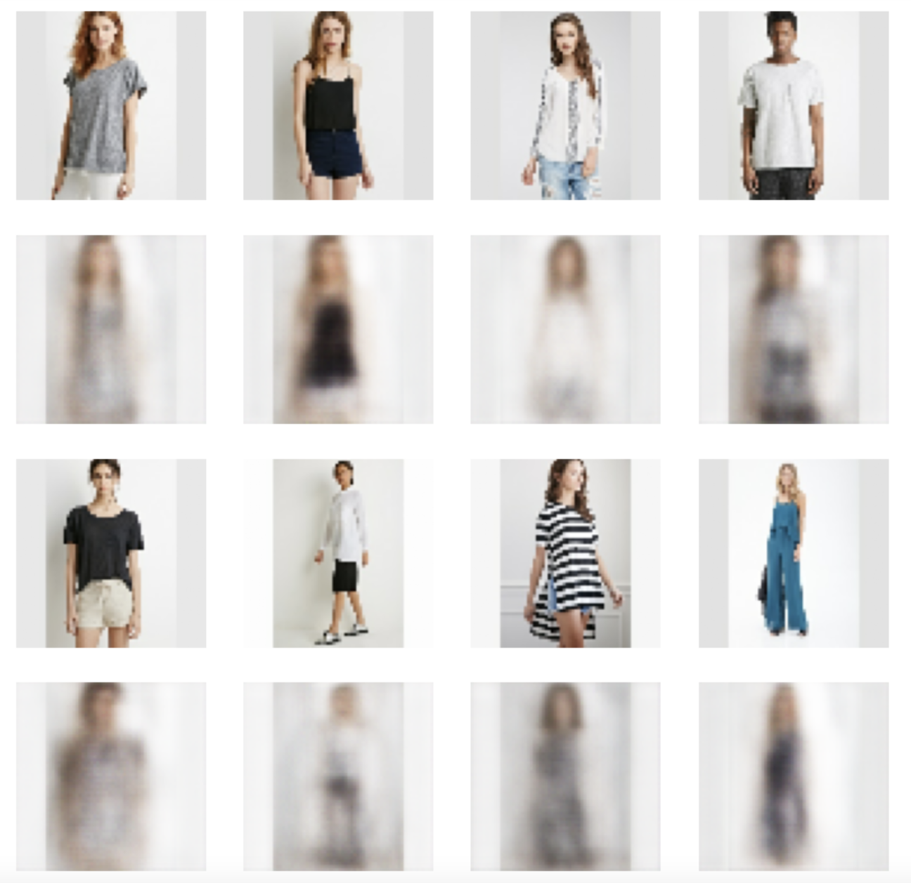
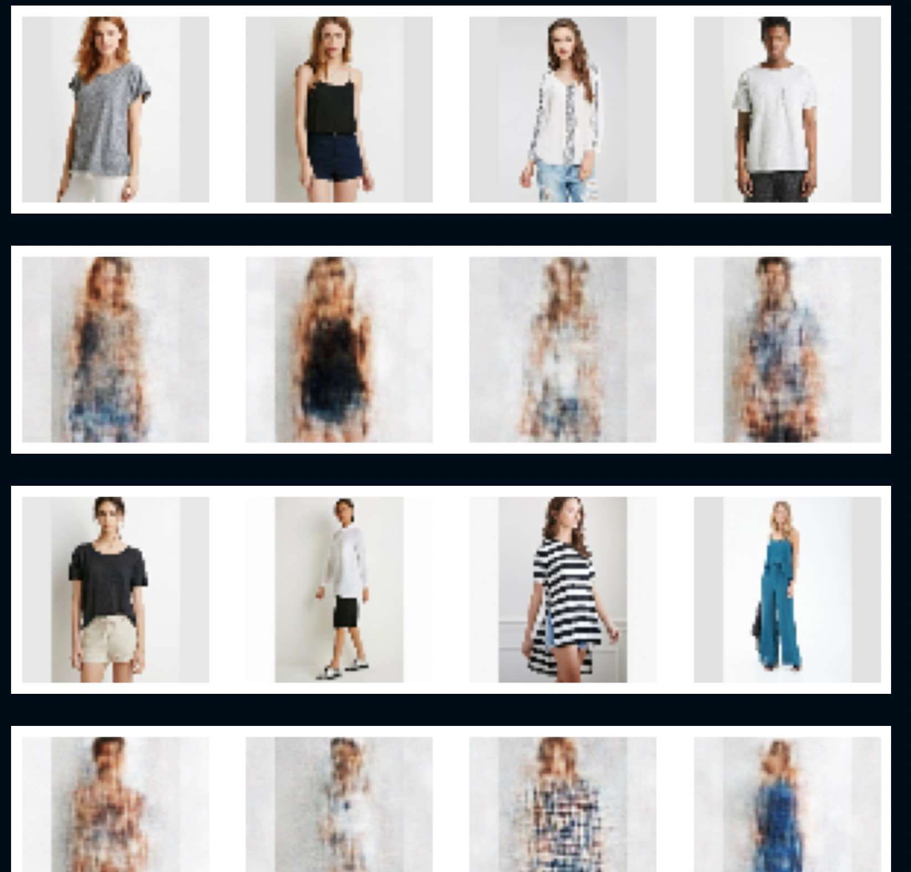
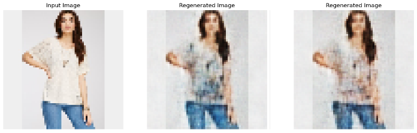
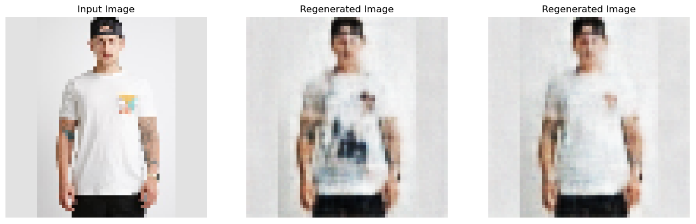

# CSCI2470-Final-Project: Fashion Forward

## Introduction
Fashion Forward aims to revolutionize the personalization trend in fashion retail by developing a deep learning model capable of transforming existing clothing images into new designs with altered attributes and styles. This project addresses the challenge faced by retailers in producing a diverse range of designs both quickly and cost-effectively.

## Project Objective
The primary objective of this project is to create a model that can regenerate a given clothing image into a new image with different attributes, such as altering a color-block hoodie into a palm-patterned jacket. Our goal is to enable retailers to offer highly personalized and customized clothing options, enhancing the overall shopping experience for customers.

## Technologies Used
- Deep Learning Model: Conditional Variational Autoencoder (CVAE)
- Dataset: DeepFashion, consisting of over 8,000 clothing items with various attributes
- Programming Language: Python
- Libraries: TensorFlow, Keras

## Model Structure
**Initial Model**: CVAE
- Architecture: Conditional Variational Autoencoder.
- Process: The model takes input images and their attributes, processes them through an encoder to sample from a latent distribution, and uses a decoder conditioned on desired attributes to generate transformed images.
- Optimization: The loss function and hyperparameters are continually optimized to minimize reconstruction error, which measures how closely the generated images match the original inputs.
  
**Updated Model**: Enhanced with U-Net and VGG16
- Architecture Integration: Incorporation of U-Net, known for its efficacy in semantic segmentation, adapted for our image transformation tasks.
- Fine-grained Detailing: U-Net's skip connections help retain crucial spatial information, allowing for better detail preservation.
- Feature Extraction: A pre-trained VGG16 model is included in the encoder part to enhance feature extraction capabilities, providing a robust foundation for the decoder to generate detailed and accurate images.

## Loss Function
Our model utilizes a composite loss function to optimize the training process, which consists of:

**Reconstruction Loss (L1)**: This is the Mean Squared Error (MSE) that measures the difference between the original and the reconstructed images, emphasizing pixel-level accuracy.

**Regularization Loss (L2)**: This component, known as the Kullback-Leibler (KL) divergence, helps in regulating the distribution of the latent variables to match a prior distribution, typically a Gaussian. This ensures a smoother and more continuous latent space, aiding in the generation of diverse and coherent outputs.

The total loss is calculated as:

**Loss = Reconstruction Loss (L1) + Regularization Loss (L2)
     = Mean Squared Error + KL Divergence**
     
This combination allows our model to not only accurately recreate input images but also to ensure that the generated images are varied yet realistic, adhering to the underlying distribution.

## Model Performance
Our project utilizes a Conditional Variational Autoencoder (CVAE) integrated with U-Net architecture, enhancing the capability to generate personalized clothing items with distinct attributes. The results are presented after 10 epochs and 200 epochs to show the model's performance over training time.

Reconstruction Results after 10 Epochs
Initially, the model demonstrates a basic ability to reconstruct the input images. While the details are somewhat blurred, the overall shapes and colors are recognizable, indicating the model's potential.

Reconstruction Results after 200 Epochs
With extended training, the model significantly improves, capturing finer details and more accurate colors. The reconstructed images closely resemble the original inputs, showcasing the effectiveness of the deep learning techniques utilized.

**Enhanced Results** - Personalized Color Transformations
One of the standout features of our model is its ability to apply personalized color transformations to clothing items. This capability demonstrates not only the model's understanding of fashion aesthetics but also its potential in real-world applications where consumers seek customization. Below are a few examples showcasing the model's ability in altering the colors of different apparel items, enhancing their appeal and variety.

## Conclusion
Throughout the development and training of our model, we have observed consistent improvements in the quality and accuracy of the image transformations, particularly with extended training periods. Our results after 200 epochs clearly demonstrate the model's potential in generating personalized and aesthetically pleasing clothing items.

Due to computational constraints, we limited our training to 200 epochs. However, the observed trends suggest that additional training could yield even better results. We believe that with more epochs, the model could achieve finer details and more accurate color reproductions, further enhancing its ability to meet diverse consumer preferences.

Looking ahead, we are interested in exploring other advanced modeling techniques to enhance our project's capabilities. Diffusion models, known for their state-of-the-art performance in generating high-quality images, are particularly promising. We anticipate that incorporating such models could provide significant breakthroughs in the realism and creativity of our fashion transformations.
